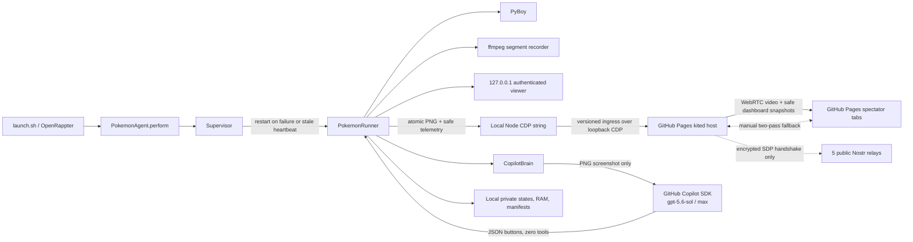

# RAPPter Plays Pokémon

Run a real, single-file OpenRappter agent that lets GitHub Copilot autonomously
attempt a full playthrough of Pokémon Red in a local PyBoy emulator. It can
persist progress for long-running sessions, record segmented MP4 clips, expose
an authenticated local viewer, optionally broadcast directly
browser-to-browser, and hand control to you at any time.

> [!IMPORTANT]
> This repository is **ROM-free**. You must supply your own legally obtained
> Pokémon Red Game Boy (`.gb`) ROM. The project never downloads, searches for,
> copies, uploads, or distributes a ROM. Do not open an issue asking for one.

This is an experimental autonomous player. It attempts to reach the Hall of
Fame, but **it is not guaranteed to beat the game**.

## What you get

- **A RAPP agent, not a skill:** [`pokemon_agent.py`](pokemon_agent.py) contains
  the complete native `BasicAgent` contract, metadata, deterministic runtime,
  and `perform()` implementation.
- **GitHub Copilot SDK brain:** defaults to `gpt-5.6-sol` with
  `reasoning_effort="max"`.
- **Tool isolation:** the SDK session has zero tools, no skill/config discovery,
  no memory/session store, and receives only PNG screenshots as attachments.
- **Durable PyBoy runtime:** atomic checkpoints, cartridge RAM persistence,
  hash-checked resume, and supervised recovery after failures or stale
  heartbeats.
- **Local viewer and takeover:** authenticated browser session on
  `127.0.0.1`, strict same-origin controls, pause/resume, manual buttons, and
  return-to-autonomy.
- **Optional kited-twin livestream:** a dedicated GitHub Pages tab hosts
  direct WebRTC video and a tightly allowlisted run dashboard. Encrypted Nostr
  relays perform handshake-only signaling; a local CDP string tethers the tab
  to private runtime frames without exposing localhost.
- **Bounded recording:** local, rotating H.264 MP4 clips with manifests,
  retention limits, a disk budget, and a free-space reserve.
- **Local-only state:** ROM path, screenshots, saves, logs, and videos stay in a
  private local runtime directory.

## Prerequisites

The supported path is **macOS**. The launcher fails clearly on other platforms.

1. Python 3.11 or newer
2. `git`
3. [`ffmpeg`](https://ffmpeg.org/) (`brew install ffmpeg`)
4. A GitHub account with an active Copilot entitlement
5. GitHub Copilot CLI/SDK authentication already available to your user
6. Your own legally obtained Pokémon Red `.gb` ROM stored locally
7. For livestreaming only: Node.js 22+ and Google Chrome, Chrome for Testing,
   or Chromium

The bootstrap installs a private `.venv`, a pinned OpenRappter revision,
`github-copilot-sdk>=1.0.6,<2`, and `PyBoy>=2.6.1,<3`. It does not install or
locate game content.

## Quickstart

```bash
git clone https://github.com/kody-w/rappter-plays-pokemon.git
cd rappter-plays-pokemon
./bootstrap.sh --rom "/absolute/path/to/your/Pokemon Red.gb"
```

That one bootstrap command creates the environment, installs OpenRappter and
runtime dependencies, atomically registers `pokemon_agent.py` in that isolated
OpenRappter installation, prepares the Copilot SDK runtime, launches the
supervisor, and opens the authenticated viewer.

Use an existing OpenRappter checkout instead:

```bash
./bootstrap.sh \
  --openrappter-source "/path/to/openrappter" \
  --rom "/absolute/path/to/your/Pokemon Red.gb"
```

Setup without launching:

```bash
./bootstrap.sh --setup-only
```

## Commands

All commands operate on the default private runtime directory,
`~/.openrappter/pokemon-red`.

```bash
./launch.sh --rom "/absolute/path/to/your/Pokemon Red.gb"  # start/resume
./launch.sh status                                         # progress
./launch.sh view                                           # authenticated viewer
./launch.sh pause                                          # freeze emulation
./launch.sh resume                                         # resume prior mode
./launch.sh manual                                         # take control
./launch.sh press up                                       # up/down/left/right
./launch.sh press a                                        # a/b/start/select
./launch.sh autonomy                                       # return control to Copilot
./launch.sh checkpoint                                     # save + rotate clip
./launch.sh host                                           # focus managed Pages host
./launch.sh go-live                                        # clear a latched host End
./launch.sh share                                          # private spectator link/state
./launch.sh stop                                           # checkpoint and stop cleanly
./launch.sh provision-browser                              # optional stable macOS CfT
```

`launch.sh` never replaces the registered single-file agent for status or
control actions. After updating this checkout while a supervisor is live,
migrate in this order:

```bash
./launch.sh checkpoint
./launch.sh stop
./launch.sh status  # wait until running is false
./launch.sh start --rom "/absolute/path/to/your/Pokemon Red.gb"
```

Start performs registration only after the old runner and supervisor have
exited and refuses to hot-swap code beneath either live process.

Useful start options:

```bash
./launch.sh start \
  --rom "/absolute/path/to/your/Pokemon Red.gb" \
  --clip-minutes 10 \
  --max-clips 200 \
  --max-states 256 \
  --max-storage-gb 20 \
  --min-free-gb 2 \
  --port 8765
```

`--visible` also opens PyBoy's native SDL window. The browser viewer works
without it. `--no-open-viewer` prevents automatic browser launch.
`--no-resume` deliberately starts without loading a checkpoint; it does not
delete existing saves.

### Browser livestream

Livestreaming is opt-in. The recommended and default livestream host is the
**kited twin** at
<https://kody-w.github.io/rappter-plays-pokemon/host/v2/>:

```bash
./launch.sh start \
  --rom "/absolute/path/to/your/Pokemon Red.gb" \
  --livestream \
  --livestream-host kite \
  --join-base https://kody-w.github.io/rappter-plays-pokemon/watch/v2/ \
  --host-base https://kody-w.github.io/rappter-plays-pokemon/host/v2/ \
  --port 0
./launch.sh share
```

The architecture deliberately reverses the old local-host arrangement:

1. The local runner atomically publishes a 160×144 PNG and the strict
   `project_dashboard_snapshot` into its mode-`0600` runtime directory.
2. A zero-dependency Node 22 **string** launches a visible, dedicated
   Chrome/Chromium process with a private generation profile and loopback-only
   Chrome DevTools Protocol endpoint.
3. The string selects only the exact Pages `/host/v2/` URL and nonsecret instance
   fragment, verifies the host build, then injects bootstrap, frames,
   telemetry, and heartbeats through a versioned page ingress object.
4. The Pages tab actively joins a private Trystero/Nostr room, owns the canvas
   capture stream, strict spectator admission, viewer fanout, Share-sheet/QR
   UI, and
   standard/Safari Picture in Picture. Viewer tabs join with `passive:true`, so
   viewers do not mesh with one another.
5. A v2 invitation is
   `/watch/v2/#v=2&room=…&key=…&gen=…&pub=…&fp=…`. Python independently
   generates a 128-bit room ID and 256-bit shared signaling key. The local
   Node string generates and persists a generation-private ECDSA P-256 key in
   mode-`0600` state, injects its private JWK only into host page memory, and
   places only its public JWK/fingerprint in invitations.
6. Trystero sends encrypted SDP redundantly through five reviewed public Nostr
   relays. After the authenticated role/capability handshake, canvas media
   travels directly via WebRTC/DTLS-SRTP and dashboard actions travel directly
   via SCTP/DTLS. Established media is not torn down merely because relay
   sockets disconnect.

This follows the `kody-w/rapp-kite` kited-twin/string/tether pattern, but not
its broad console-evaluation, chat, or localhost-proxy sample behavior. This
string is a generation-bound one-way video/telemetry diode.

GitHub Pages never relays game bytes and never requests localhost. It serves
only static checked-in HTML, CSS, JavaScript, pinned
Trystero/PeerJS/QRious assets, and licenses. The bare host page is inert: it
creates no signaling or media connection until the exact local CDP bootstrap
arrives. The local string accepts no remote
commands and sends no control surface to Pages.

The string validates the PNG signature, dimensions, size (128 KiB maximum),
generation, monotonic sequence, and SHA-256. It deduplicates exact frames,
targets at most 10 unique frames per second, keeps only one CDP call in flight,
and replaces one pending slot with the latest frame. Safe telemetry is at most
4096 bytes, changed at most once per second, with an unchanged heartbeat around
five seconds. Missing source/string heartbeats visibly degrade health and tear
down signaling rooms and capture tracks after a bounded grace. Browser or string failure
is a nonfatal sidecar failure: gameplay, Copilot, recording, and checkpoints
continue while `status` reports the livestream as degraded.

The room key exists only in mode-`0600` bootstrap state, the URL fragment, QR,
and page memory. The browser target URL contains only a nonsecret instance
selector. Valid viewers clear the fragment from the address bar after parsing;
browsers do not include fragments in normal HTTP requests, so GitHub Pages and
its access logs do not receive the secret. Viewer role proofs use the shared
key, but host identity never does: the host signs the complete peer IDs,
roles, nonces, generation, target, expiry, and sequence transcript with its
generation-only ECDSA key. A viewer holding the room key cannot forge that
signature. `share` reports automatic and manual signaling health separately
and exposes the key
only inside the explicit private join URL. Treat the complete link and locally
rendered QR code as bearer secrets.

Public relay service is best effort and has no SLA. Relay operators can observe
connecting IP addresses, timing, relay URLs, ephemeral Nostr public keys,
event IDs/signatures, `created_at`, kind, and the plaintext `x` topic-hash tag;
EVENT content is encrypted with the private room key. Runtime relay health
requires observed EVENT acceptance and subscribed delivery, not merely an
open socket/EOSE. The project owns no
relay or signaling server and does not require Azure. The exact reviewed
origins and local handshake review date are recorded in
[`vendor/browser/NOSTR_RELAYS.json`](vendor/browser/NOSTR_RELAYS.json).

If every signaling WebSocket is blocked, select **Create Manual Share**. The
host shares a five-minute, single-use fragment-only offer link through
`navigator.share({url})`, QR, or copy. The viewer creates the encrypted answer
and selects **Share Answer Back**. That public `/host/v2/return/#…` link keeps
the answer, exact loopback callback, generation, and pairing-only return token
after `#`; when opened in any default browser on the streamer Mac, it performs
a visible top-level handoff (never a Pages-to-localhost fetch) to
`http://127.0.0.1:<current-port>/pair-return#…`. The inert local page posts the
bounded answer same-origin to a token/generation/Origin/Host-checked pairing
endpoint, and the CDP string delivers it to the exact host ingress. Copy/QR and
the host-page raw-answer paste remain fallbacks. New v2 senders always use
bounded uncompressed SDP (`zip=none`) because receiver gzip capability is not
known; oversized links become copy/share-only and are never truncated.

`./launch.sh view` opens only the authenticated local game/control page.
`./launch.sh host` asks the already managed CDP connection to focus the exact
Pages host; it never opens a duplicate. End, Stop, target navigation, string
loss, browser exit, or capture end destroys the peer, connections, and tracks.
Host **End** is generation-bound and remains latched across sidecar/browser
recovery; only **Go Live**, **Retry**, or `./launch.sh go-live` clears it. The
sidecar independently restarts with bounded backoff and never kills an
unrelated browser.

Use an installed browser override:

```bash
./launch.sh start --livestream \
  --browser-path "/Applications/Google Chrome.app/Contents/MacOS/Google Chrome" \
  --rom "/absolute/path/to/your/Pokemon Red.gb"
```

`RPP_BROWSER_PATH` and `CHROME_PATH` are also supported. Without an override,
standard Chrome for Testing, Google Chrome, and Chromium locations are checked.
The deterministic macOS helper fetches the official stable Chrome-for-Testing
manifest, validates the archive shape and either Google's signing team or the
official CfT ad-hoc testing identity when `codesign` is available, and installs
atomically under a private locked cache:

```bash
./launch.sh provision-browser
# Copy the returned browser_path into your private config.
```

Provisioning is explicit; bootstrap, tests, and CI never download a browser.

The dashboard's **Caught / owned** count is the Generation-I Pokédex Owned
bitfield at WRAM `0xD2F7`, not a log of literal capture events. It may
legitimately exceed Seen, and unavailable WRAM is displayed as unknown rather
than as zero progress.

Useful livestream options:

```text
--livestream-host MODE     kite (default/recommended) or local rollback
--signaling MODE           nostr (kite default) or peerjs legacy rollback
--browser-path PATH        dedicated Chrome/Chromium executable
--host-base HTTPS_URL      static Pages host base
--bridge-startup-timeout S bounded target/bootstrap timeout (2-120)
--join-base HTTPS_URL      canonical Pages or compatible HTTPS spectator page
--max-viewers N            mesh fanout (default 5, hard limit 8)
--no-livestream            override a config file that enables streaming
```

`--join-base` and `--host-base` must be HTTPS and should retain trailing
slashes. `--port 0` remains supported. Kite mode starts no LAN spectator
server. For rollback, `--livestream-host local` preserves the prior
authenticated-viewer broadcaster and LAN static spectator server; only that
mode uses `--spectator-port` and `--advertised-host`.
`--signaling peerjs` preserves v1 fragment links for rollback. PeerJS is not
the default signaling dependency. Legacy local hosting supports PeerJS only.
Existing root `/host/` and `/watch/` v1 URLs remain byte-for-byte rollback
assets. New runners default to the side-by-side `/host/v2/` and `/watch/v2/`
trees with immutable versioned script filenames, so a cached v1 HTML document
cannot load a v2 protocol script. Deploy both trees before changing runner
defaults.

To use a config file, copy the safe template outside version control, fill in
your local ROM path, and pass it explicitly:

```bash
cp config.example.json config.json
./launch.sh start --config config.json
```

## Runtime files and recording

Default private state lives under `~/.openrappter/pokemon-red/` with mode `0700`;
files containing local state are mode `0600`.

| Path | Purpose |
| --- | --- |
| `clips/*.mp4` | Completed local recording segments |
| `clips/*.json` | Clip hashes, timing, and game-state manifests |
| `states/*.state` | Atomic PyBoy checkpoints |
| `states/*.json` | Checkpoint hash and matching-ROM manifest |
| `pokemon-red.ram` | Atomic cartridge RAM |
| `screens/` | Bounded decision screenshots |
| `brain.json` | Recent decisions and progress context |
| `player.log` | Local supervisor/player diagnostics |
| `runtime-owner.json` | Safety marker required for explicit purge |
| `viewer-auth.json` | Short-lived authenticated viewer bootstrap secret |
| `livestream-auth.json` | Ephemeral private join capability; removed on clean shutdown |
| `livestream-status.json` | Browser-published LIVE state and bounded viewer count |
| `kite-bootstrap.json` | Generation-bound mode-`0600` CDP bootstrap; never sent in a URL |
| `kite-host-identity.json` | Mode-`0600` generation-only ECDSA private/public JWK state |
| `kite-manual-return/` | Mode-`0700` monotonic answer queue and redacted delivery acknowledgements |
| `kite-frame.json` / `kite-telemetry.json` | Atomic bounded string inputs |
| `kite-host-status.json` | Redacted bounded Pages/string health |
| `kite-profile-*` | Ephemeral dedicated browser profile, removed on stop |

The original ROM remains at the path you supplied. It is not copied into the
runtime directory. On resume, the runner verifies checkpoint hashes and the ROM
hash, skips corrupt or mismatched checkpoints, and falls back to the newest
valid state.

The defaults retain up to 200 generated clips and 256 states, cap generated
artifacts at 20 GiB, and preserve 2 GiB of free disk space. Milestone artifacts
are protected where possible; if nothing safe can be pruned, recording suspends
instead of consuming the reserve. Unknown/user-created files are never selected
for retention deletion.

## Architecture



The emulator pauses while each model decision is pending. A generation counter
discards stale AI decisions after manual takeover. The supervisor distinguishes
intentional stops from failures, restarts failed children with exponential
backoff, detects stale ready/startup heartbeats, and opens a restart circuit
after repeated crashes.

## Privacy and security model

- **No game data in Git:** `.gitignore` blocks ROMs, saves, video, screenshots,
  logs, and runtime state. CI uses generated synthetic bytes and mocks only.
- **Explicit ROM only:** the agent accepts the path argument, environment
  variable, or private runtime config; it does not scan Downloads, Documents,
  Spotlight, or the network.
- **Inference isolation:** `CopilotClient(mode="empty")`; `available_tools=[]`;
  custom instructions, skills, config discovery, memory, telemetry, and session
  persistence are disabled. The only SDK attachment is the current PNG frame.
  ROMs, RAM, save states, clips, and logs are never attached.
- **Viewer isolation:** the server binds only to `127.0.0.1`. A random,
  process-local bootstrap token establishes an HttpOnly, SameSite=Strict cookie.
  API, frame, script, stylesheet, and clip requests require that cookie.
  Mutating requests additionally require an exact loopback Origin and JSON
  content type. Host checks mitigate DNS rebinding.
- **Pages and spectator isolation:** immutable v1 rollback assets remain at
  `/host/` and `/watch/`; cache-isolated current assets live at `/host/v2/`
  and `/watch/v2/`. All are static and contain no gameplay controls. The host is
  inert before CDP bootstrap. The active host admits only passive viewers that
  complete the versioned, generation-bound role proof; media and telemetry are
  targeted only after admission. Passive mode is cooperative rather than a
  pre-SDP security boundary: an invited malicious peer can trigger encrypted
  signaling/candidate exchange before role authentication and may learn
  candidate metadata. Room ID, key, generation, public host key, and
  fingerprint are fragment-only. A fixed GET/HEAD-only LAN asset server exists only in explicit
  `--livestream-host local` rollback mode.
- **CDP string boundary:** Chrome DevTools Protocol is unauthenticated local
  same-user authority. It binds to loopback for a dedicated private browser
  profile and must never be port-forwarded, proxied, or reused with a personal
  profile. Exact target URL/build checks, a generation lock, fixed
  `Runtime.callFunctionOn` methods, and no fallback target limit that authority.
  The Pages tab cannot command the string or access localhost.
- **P2P boundary:** five allowlisted public Nostr relays redundantly carry only
  encrypted Trystero handshake SDP. Game media is protected with DTLS-SRTP;
  dashboard telemetry is direct SCTP/DTLS. Both browsers explicitly pass only
  Google `stun:stun.l.google.com:19302`, with no TURN relay. The brokerless
  manual fallback exchanges complete SDP through attended QR/copy steps.
- **Dashboard minimization:** strict Python `project_dashboard_snapshot`
  produces the only telemetry accepted by the string. The host never receives
  `/api/status`, paths, hashes, logs, errors, screen text, model reasoning, or
  action history. Snapshots are at most 4096 UTF-8 bytes, sequence checked,
  limited to one changed update per second, and sent with an unchanged
  heartbeat around five seconds. Legacy local mode retains `/api/dashboard`.
- **Local secrets:** the short-lived viewer bootstrap token, ECDSA private JWK,
  and pairing-only manual-return token are written only to
  a mode-`0600` runtime file. Livestream credentials use a separate mode-`0600`
  file. Both are removed on clean shutdown. Never paste either private URL into
  chat, logs, or bug reports.
- **Pinned browser code:** `@trystero-p2p/nostr` 0.25.3 at commit
  `f76eb4f…a11e`, its exact dependencies, documented minimal MIT-licensed
  leave/socket-lifecycle derivative patches, PeerJS 1.5.5 rollback, and
  QRious 4.0.2 are served from hash-checked embedded copies, not runtime CDNs. CSP
  allowlists five exact Nostr WSS origins plus the exact legacy PeerJS origin.

The model still sees screenshots of gameplay and structured RAM-derived game
state. GitHub's Copilot service terms and privacy policy apply to that inference.

### Livestream scope and limitations

- The media track carries game video; emulator audio is not captured.
  Dashboard v1 snapshots travel over targeted direct Trystero actions or the
  manual peer's direct RTCDataChannel.
- WebRTC can reveal network metadata/IP candidates to peers. Use the link only
  with people you trust.
- Symmetric NATs and restrictive firewalls may prevent a direct connection.
  The explicit Google STUN server discovers candidates but is not a relay; this
  release intentionally configures no TURN URLs.
- Nostr signaling redundancy is best effort, not a public relay SLA. If WSS is
  blocked by managed browser or network policy, use Manual Share pairing rather
  than attempting a policy bypass.
- Direct WebRTC peers may learn network metadata and IP candidates. The STUN
  server also observes connection metadata needed for candidate discovery.
- The canonical GitHub Pages surfaces provide HTTPS static assets. The local
  HTTP page is available only with explicit legacy local-host mode.
- Each spectator receives a separate outgoing track. Host upload and browser
  work grow linearly with viewers (`O(viewers)`).
- Browser scheduling can still throttle background tabs; 10 fps is not guaranteed.
  Picture in Picture helps keep the managed video active.
- This bounded browser mesh is intentionally not Twitch-scale infrastructure.

## Troubleshooting

### `ffmpeg is required`

```bash
brew install ffmpeg
```

Then rerun `./bootstrap.sh`.

### Copilot SDK startup/authentication fails

Confirm the same macOS user is authenticated for GitHub Copilot, then rerun:

```bash
./.venv/bin/python -m copilot download-runtime
./launch.sh --rom "/absolute/path/to/your/Pokemon Red.gb"
```

See `~/.openrappter/pokemon-red/player.log` for local diagnostics. Remove tokens,
ROM paths, screenshots, and game artifacts before sharing excerpts.

### ROM is rejected

The file must be a local, readable `.gb` file whose cartridge title identifies
Pokémon Red. Cloud placeholder files must be downloaded locally first. This
project cannot obtain or validate the legality of your copy.

### Viewer says forbidden

Open it with `./launch.sh view`; the bare port intentionally cannot mint an
authenticated session. Do not reuse an old viewer URL after a restart.

### Spectators cannot open the join page

Confirm the viewer opened the complete `/watch/v2/#...` invitation and can reach
GitHub Pages. `share` intentionally withholds the link until the Pages host is
tethered and has drawn a valid frame; `status` separately reports relay and
direct-media health. For the legacy LAN
rollback only, use `--livestream-host local --spectator-port 0` and set
`--advertised-host` if automatic LAN detection is wrong.

### Join page opens but video never arrives

Run `./launch.sh status`, then `./launch.sh host` to focus the managed Pages
host and use its Retry button. `SOURCE LOST`, `STRING LOST`, or degraded
browser health identifies a local tether problem. Ad blockers, restrictive
firewalls, or NAT behavior can prevent a direct WebRTC path. If all five relays
remain unqualified, ask the host to create a fresh **Manual Share** offer,
open it on the viewer, then share/open the answer link on the streamer Mac.
The answer QR transfers that same return link; no host camera scanner is
implemented. Raw copy/paste remains a fallback.
Manual pairing is two-pass because the viewer's complete WebRTC answer cannot
exist before it processes the offer. Neither automatic nor manual mode
provisions TURN, so restrictive NAT/UDP policy can still prevent media.

Managed Edge or network policy may intentionally block public WSS origins.
This project does not use iframes, injected code, workers, service workers, CDN
swaps, or other attempts to bypass that policy. Manual pairing is the compliant
brokerless fallback. PeerJS-specific failures at `0.peerjs.com` apply only to
explicit `--signaling peerjs` or v1 rollback invitations.

### A stale process keeps restarting

```bash
./launch.sh stop
./launch.sh status
```

The stop command changes supervisor-owned desired state before terminating the
child, so it will not restart. If the process crashed, the supervisor preserves
checkpoints and uses bounded exponential restart.

## Uninstall and cleanup

Remove only the private virtual environment and registration while **preserving
all saves and recordings**:

```bash
./uninstall.sh
```

The script reports the preserved runtime path. To explicitly delete all local
Pokemon state, including saves and recordings:

```bash
./uninstall.sh --purge-data
```

`--purge-data` is the only project command that removes user saves. Back up any
states or clips you want first.

## Development

```bash
python3.11 -m venv .venv-dev
.venv-dev/bin/pip install -e ".[dev]"
.venv-dev/bin/ruff check .
.venv-dev/bin/python -m compileall -q pokemon_agent.py src tests
.venv-dev/bin/pytest
.venv-dev/bin/python scripts/update_browser_assets.py --check
.venv-dev/bin/python scripts/build_pages_site.py --check
.venv-dev/bin/python scripts/check_browser_js.py
bash -n bootstrap.sh launch.sh uninstall.sh
```

Tests never require a commercial ROM, credentials, Copilot calls, a GUI, or
ffmpeg. See [CONTRIBUTING.md](CONTRIBUTING.md) and
[SECURITY.md](SECURITY.md).

## License and trademarks

Code in this repository is available under the [MIT License](LICENSE).
Vendored Trystero Nostr 0.25.3, Trystero core, noble-secp256k1, and PeerJS are
MIT licensed; notices for eventemitter3,
peerjs-js-binarypack, webrtc-adapter, and sdp bundled into its browser build are
also retained. QRious 4.0.2 is GPL-3.0-or-later according to its release
metadata and distribution header; its notice, complete terms, package metadata,
and unminified distribution are retained under
[`vendor/browser/`](vendor/browser/). The installed single-file agent embeds
and serves those notices and the QRious unminified distribution.
Pokémon and related names are trademarks of their respective owners. This
independent project is not affiliated with or endorsed by Nintendo, The Pokémon
Company, Game Freak, GitHub, or PyBoy.
