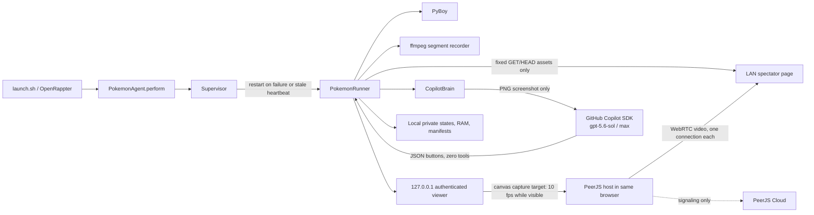

# RAPPter Plays Pokémon

Run a real, single-file OpenRappter agent that lets GitHub Copilot autonomously
attempt a full playthrough of Pokémon Red in a local PyBoy emulator. It can
persist progress for long-running sessions, record segmented MP4 clips, expose
an authenticated local viewer, optionally broadcast browser-to-browser with
PeerJS, and hand control to you at any time.

> [!IMPORTANT]
> This repository is **ROM-free**. You must supply your own legally obtained
> Pokémon Red Game Boy (`.gb`) ROM. The project never downloads, searches for,
> copies, uploads, or distributes a ROM. Do not open an issue asking for one.

This is an experimental autonomous player. It attempts to reach the Hall of
Fame, but **it is not guaranteed to beat the game**.

## What you get

- **A RAPP agent, not a skill:** [`pokemon_agent.py`](pokemon_agent.py) contains
  the complete native `BasicAgent` contract, metadata, deterministic runtime,
  and `perform()` implementation.
- **GitHub Copilot SDK brain:** defaults to `gpt-5.6-sol` with
  `reasoning_effort="max"`.
- **Tool isolation:** the SDK session has zero tools, no skill/config discovery,
  no memory/session store, and receives only PNG screenshots as attachments.
- **Durable PyBoy runtime:** atomic checkpoints, cartridge RAM persistence,
  hash-checked resume, and supervised recovery after failures or stale
  heartbeats.
- **Local viewer and takeover:** authenticated browser session on
  `127.0.0.1`, strict same-origin controls, pause/resume, manual buttons, and
  return-to-autonomy.
- **Optional P2P livestream:** the authenticated viewer becomes the video-only
  host, renders the game through a nearest-neighbor canvas, and shares a QRious
  QR code and bearer join link with up to five spectators by default.
- **Bounded recording:** local, rotating H.264 MP4 clips with manifests,
  retention limits, a disk budget, and a free-space reserve.
- **Local-only state:** ROM path, screenshots, saves, logs, and videos stay in a
  private local runtime directory.

## Prerequisites

The supported path is **macOS**. The launcher fails clearly on other platforms.

1. Python 3.11 or newer
2. `git`
3. [`ffmpeg`](https://ffmpeg.org/) (`brew install ffmpeg`)
4. A GitHub account with an active Copilot entitlement
5. GitHub Copilot CLI/SDK authentication already available to your user
6. Your own legally obtained Pokémon Red `.gb` ROM stored locally

The bootstrap installs a private `.venv`, a pinned OpenRappter revision,
`github-copilot-sdk>=1.0.6,<2`, and `PyBoy>=2.6.1,<3`. It does not install or
locate game content.

## Quickstart

```bash
git clone https://github.com/kody-w/rappter-plays-pokemon.git
cd rappter-plays-pokemon
./bootstrap.sh --rom "/absolute/path/to/your/Pokemon Red.gb"
```

That one bootstrap command creates the environment, installs OpenRappter and
runtime dependencies, atomically registers `pokemon_agent.py` in that isolated
OpenRappter installation, prepares the Copilot SDK runtime, launches the
supervisor, and opens the authenticated viewer.

Use an existing OpenRappter checkout instead:

```bash
./bootstrap.sh \
  --openrappter-source "/path/to/openrappter" \
  --rom "/absolute/path/to/your/Pokemon Red.gb"
```

Setup without launching:

```bash
./bootstrap.sh --setup-only
```

## Commands

All commands operate on the default private runtime directory,
`~/.openrappter/pokemon-red`.

```bash
./launch.sh --rom "/absolute/path/to/your/Pokemon Red.gb"  # start/resume
./launch.sh status                                         # progress
./launch.sh view                                           # authenticated viewer
./launch.sh pause                                          # freeze emulation
./launch.sh resume                                         # resume prior mode
./launch.sh manual                                         # take control
./launch.sh press up                                       # up/down/left/right
./launch.sh press a                                        # a/b/start/select
./launch.sh autonomy                                       # return control to Copilot
./launch.sh checkpoint                                     # save + rotate clip
./launch.sh share                                          # private spectator link/state
./launch.sh stop                                           # checkpoint and stop cleanly
```

Useful start options:

```bash
./launch.sh start \
  --rom "/absolute/path/to/your/Pokemon Red.gb" \
  --clip-minutes 10 \
  --max-clips 200 \
  --max-states 256 \
  --max-storage-gb 20 \
  --min-free-gb 2 \
  --port 8765
```

`--visible` also opens PyBoy's native SDL window. The browser viewer works
without it. `--no-open-viewer` prevents automatic browser launch.
`--no-resume` deliberately starts without loading a checkpoint; it does not
delete existing saves.

### Browser livestream

Livestreaming is opt-in. Use the repository's canonical HTTPS spectator page
and ephemeral local ports with:

```bash
./launch.sh start \
  --rom "/absolute/path/to/your/Pokemon Red.gb" \
  --livestream \
  --join-base https://kody-w.github.io/rappter-plays-pokemon/watch/ \
  --port 0 \
  --spectator-port 0
./launch.sh share
```

The checked-in page at
<https://kody-w.github.io/rappter-plays-pokemon/watch/> is only static
spectator HTML, CSS, JavaScript, the pinned PeerJS 1.5.5 bundle, and license
notices. It contains no invitation, host identity, capability, game frame,
status, control, token, or ROM API. The private host ID and watch capability
are added after `#` in the link produced by the host. Browsers do not send that
fragment in HTTP requests, so it does not reach GitHub Pages or its HTTP access
logs. Keep the complete link private.

Keep the dedicated authenticated game viewer open and visible: that browser is
the streamer. It automatically goes live, targets 10 canvas captures per
second while visible, and shows **Go Live**, **End**, and **Retry** controls,
LIVE/reconnecting state, viewer count, the exact join link, and a locally
rendered QRious QR code. Browsers may throttle minimized or background tabs, so
10 fps is not guaranteed. No click is required for initial broadcast. Because
the browser is the host, enabling livestreaming opens the viewer even if
`--no-open-viewer` is also configured; that option applies to local-only
sessions.

Before creating PeerJS, the page acquires a generation-scoped browser lease
from the local runtime. Only one fresh viewer tab can own it. Heartbeats keep
the lease and reported LIVE state current; runtime restart, lease loss, repeated
backend failures, End/Stop, capture end, or closing the page tears down PeerJS,
all peer connections, and canvas tracks. Stale browser reports become offline.

The local spectator asset server still starts separately on the LAN, even when
`--join-base` selects GitHub Pages for shared links. It remains an immediate
fallback and compatible static source, serving only a fixed read-only page,
CSS, JavaScript, and the pinned PeerJS library. It never serves frames, status,
controls, clips, paths, tokens, or ROM data. GitHub Pages has the same static
spectator files. PeerJS Cloud performs signaling only; actual game video
travels browser-to-browser over WebRTC where direct connectivity succeeds.

Useful livestream options:

```text
--spectator-port PORT      LAN page port; 0 selects an available port
--advertised-host HOST     hostname/IP placed in the LAN join link
--join-base HTTPS_URL      canonical Pages or compatible HTTPS spectator page
--max-viewers N            mesh fanout (default 5, hard limit 8)
--no-livestream            override a config file that enables streaming
```

Without `--advertised-host`, the agent advertises its best detected LAN IPv4
address. If that is not reachable from the other device, pass the Mac's LAN
hostname or address explicitly. `--join-base` must be HTTPS; use
`https://kody-w.github.io/rappter-plays-pokemon/watch/` for the canonical
published page. Its trailing slash is retained so the private fragment reaches
the page without a directory redirect. The local asset server still starts for
immediate LAN use. Ports `0` are replaced by their actual bound ports in viewer
URLs, status, and share links. A fixed-port conflict fails with a clear bind
error.

To use a config file, copy the safe template outside version control, fill in
your local ROM path, and pass it explicitly:

```bash
cp config.example.json config.json
./launch.sh start --config config.json
```

## Runtime files and recording

Default private state lives under `~/.openrappter/pokemon-red/` with mode `0700`;
files containing local state are mode `0600`.

| Path | Purpose |
| --- | --- |
| `clips/*.mp4` | Completed local recording segments |
| `clips/*.json` | Clip hashes, timing, and game-state manifests |
| `states/*.state` | Atomic PyBoy checkpoints |
| `states/*.json` | Checkpoint hash and matching-ROM manifest |
| `pokemon-red.ram` | Atomic cartridge RAM |
| `screens/` | Bounded decision screenshots |
| `brain.json` | Recent decisions and progress context |
| `player.log` | Local supervisor/player diagnostics |
| `runtime-owner.json` | Safety marker required for explicit purge |
| `viewer-auth.json` | Short-lived authenticated viewer bootstrap secret |
| `livestream-auth.json` | Ephemeral private join capability; removed on clean shutdown |
| `livestream-status.json` | Browser-published LIVE state and bounded viewer count |

The original ROM remains at the path you supplied. It is not copied into the
runtime directory. On resume, the runner verifies checkpoint hashes and the ROM
hash, skips corrupt or mismatched checkpoints, and falls back to the newest
valid state.

The defaults retain up to 200 generated clips and 256 states, cap generated
artifacts at 20 GiB, and preserve 2 GiB of free disk space. Milestone artifacts
are protected where possible; if nothing safe can be pruned, recording suspends
instead of consuming the reserve. Unknown/user-created files are never selected
for retention deletion.

## Architecture



The emulator pauses while each model decision is pending. A generation counter
discards stale AI decisions after manual takeover. The supervisor distinguishes
intentional stops from failures, restarts failed children with exponential
backoff, detects stale ready/startup heartbeats, and opens a restart circuit
after repeated crashes.

## Privacy and security model

- **No game data in Git:** `.gitignore` blocks ROMs, saves, video, screenshots,
  logs, and runtime state. CI uses generated synthetic bytes and mocks only.
- **Explicit ROM only:** the agent accepts the path argument, environment
  variable, or private runtime config; it does not scan Downloads, Documents,
  Spotlight, or the network.
- **Inference isolation:** `CopilotClient(mode="empty")`; `available_tools=[]`;
  custom instructions, skills, config discovery, memory, telemetry, and session
  persistence are disabled. The only SDK attachment is the current PNG frame.
  ROMs, RAM, save states, clips, and logs are never attached.
- **Viewer isolation:** the server binds only to `127.0.0.1`. A random,
  process-local bootstrap token establishes an HttpOnly, SameSite=Strict cookie.
  API, frame, script, stylesheet, and clip requests require that cookie.
  Mutating requests additionally require an exact loopback Origin and JSON
  content type. Host checks mitigate DNS rebinding.
- **Spectator isolation:** an independent server binds on the LAN only when
  livestreaming is enabled. It accepts GET/HEAD for fixed spectator assets and
  has no APIs. The checked-in GitHub Pages surface serves the same static
  spectator assets and nothing from the runtime. The spectator page contains
  no emulator control code. Host and watch IDs are independent high-entropy
  values in the URL fragment, so normal LAN and GitHub Pages HTTP requests and
  access logs do not contain them.
- **P2P boundary:** PeerJS Cloud performs signaling. Game media is a WebRTC
  video track protected in transit with DTLS-SRTP and sent directly between
  browsers where connectivity permits. The watch link is a bearer capability;
  anyone who receives it can attempt to watch until the host session ends.
  Both host and spectator pass the same explicit ICE configuration: Google
  `stun:stun.l.google.com:19302` only, with no TURN relay.
- **Local secrets:** the short-lived viewer bootstrap token is written only to
  a mode-`0600` runtime file. Livestream credentials use a separate mode-`0600`
  file. Both are removed on clean shutdown. Never paste either private URL into
  chat, logs, or bug reports.
- **Pinned browser code:** PeerJS 1.5.5 and QRious 4.0.2 are served from
  hash-checked embedded copies, not runtime CDNs. CSP permits only the exact
  PeerJS Cloud HTTPS/WSS signaling origin required by the enabled stream.

The model still sees screenshots of gameplay and structured RAM-derived game
state. GitHub's Copilot service terms and privacy policy apply to that inference.

### Livestream scope and limitations

- v1 is video-only; emulator audio is not captured.
- WebRTC can reveal network metadata/IP candidates to peers. Use the link only
  with people you trust.
- Symmetric NATs and restrictive firewalls may prevent a direct connection.
  The explicit Google STUN server discovers candidates but is not a relay; this
  release intentionally configures no TURN URLs.
- Direct WebRTC peers may learn network metadata and IP candidates. The STUN
  server also observes connection metadata needed for candidate discovery.
- The canonical GitHub Pages surface provides HTTPS static assets. The local
  HTTP page remains available as a LAN fallback.
- Each spectator receives a separate outgoing track. Host upload and browser
  work grow linearly with viewers (`O(viewers)`).
- This bounded browser mesh is intentionally not Twitch-scale infrastructure.

## Troubleshooting

### `ffmpeg is required`

```bash
brew install ffmpeg
```

Then rerun `./bootstrap.sh`.

### Copilot SDK startup/authentication fails

Confirm the same macOS user is authenticated for GitHub Copilot, then rerun:

```bash
./.venv/bin/python -m copilot download-runtime
./launch.sh --rom "/absolute/path/to/your/Pokemon Red.gb"
```

See `~/.openrappter/pokemon-red/player.log` for local diagnostics. Remove tokens,
ROM paths, screenshots, and game artifacts before sharing excerpts.

### ROM is rejected

The file must be a local, readable `.gb` file whose cartridge title identifies
Pokémon Red. Cloud placeholder files must be downloaded locally first. This
project cannot obtain or validate the legality of your copy.

### Viewer says forbidden

Open it with `./launch.sh view`; the bare port intentionally cannot mint an
authenticated session. Do not reuse an old viewer URL after a restart.

### Spectators cannot open the join page

Start with `--spectator-port 0`, run `./launch.sh share`, and confirm the
advertised host is reachable from the spectator's LAN. If automatic detection
selected the wrong interface, restart with `--advertised-host` set to the
host's LAN address. Do not expose or proxy the authenticated loopback viewer.

### Join page opens but video never arrives

Leave the host viewer open and use its Retry button. Ad blockers, restrictive
firewalls, NAT behavior, or blocked access to `0.peerjs.com` can prevent
signaling or a direct WebRTC path. v1 does not provision a TURN relay.

### A stale process keeps restarting

```bash
./launch.sh stop
./launch.sh status
```

The stop command changes supervisor-owned desired state before terminating the
child, so it will not restart. If the process crashed, the supervisor preserves
checkpoints and uses bounded exponential restart.

## Uninstall and cleanup

Remove only the private virtual environment and registration while **preserving
all saves and recordings**:

```bash
./uninstall.sh
```

The script reports the preserved runtime path. To explicitly delete all local
Pokemon state, including saves and recordings:

```bash
./uninstall.sh --purge-data
```

`--purge-data` is the only project command that removes user saves. Back up any
states or clips you want first.

## Development

```bash
python3.11 -m venv .venv-dev
.venv-dev/bin/pip install -e ".[dev]"
.venv-dev/bin/ruff check .
.venv-dev/bin/python -m compileall -q pokemon_agent.py src tests
.venv-dev/bin/pytest
.venv-dev/bin/python scripts/update_browser_assets.py --check
.venv-dev/bin/python scripts/build_pages_site.py --check
.venv-dev/bin/python scripts/check_browser_js.py
bash -n bootstrap.sh launch.sh uninstall.sh
```

Tests never require a commercial ROM, credentials, Copilot calls, a GUI, or
ffmpeg. See [CONTRIBUTING.md](CONTRIBUTING.md) and
[SECURITY.md](SECURITY.md).

## License and trademarks

Code in this repository is available under the [MIT License](LICENSE).
Vendored PeerJS is MIT licensed; notices for eventemitter3,
peerjs-js-binarypack, webrtc-adapter, and sdp bundled into its browser build are
also retained. QRious 4.0.2 is GPL-3.0-or-later according to its release
metadata and distribution header; its notice, complete terms, package metadata,
and unminified distribution are retained under
[`vendor/browser/`](vendor/browser/). The installed single-file agent embeds
and serves those notices and the QRious unminified distribution.
Pokémon and related names are trademarks of their respective owners. This
independent project is not affiliated with or endorsed by Nintendo, The Pokémon
Company, Game Freak, GitHub, or PyBoy.
